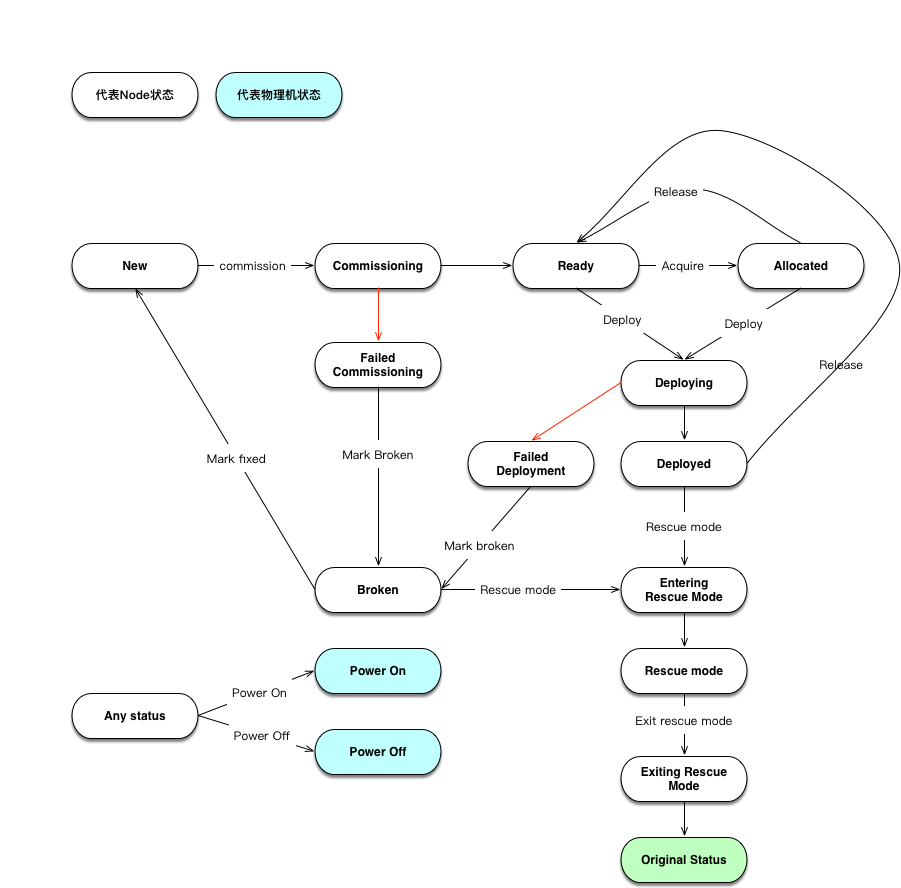

# maas-learn

Learning Ubuntu MAAS

# 注意事项

1. 配置subnet，如果无法正确配置subnet，可能会造成PXE boot因无法下载软件包而失败
   1. 配置DNS，比如``8.8.8.8 8.8.4.4``。
   2. 配置gateway IP。
2. 到Settings - Package repositories修改软件源地址（否则可能出现Deploy阶段因下载不到操作系统而出错）
   1. Ubuntu archive地址到[国内镜像][ubuntu-mirror-list]地址，http://mirrors.aliyun.com/ubuntu/  （默认地址：http://archive.ubuntu.com/ubuntu）
   2. Ubuntu extra architectures地址到：https://mirrors.ustc.edu.cn/ubuntu-ports/ （默认地址：http://ports.ubuntu.com/ubuntu-ports）

# Node状态

参考文档：[Node actions][doc-node-actions] & [Node statuses][doc-node-statuses]

[ubuntu-mirror-list]: https://launchpad.net/ubuntu/+archivemirrors
[doc-node-actions]: https://docs.maas.io/2.1/en/intro-concepts#node-actions
[doc-node-statuses]: https://docs.maas.io/2.1/en/intro-concepts#node-statuses